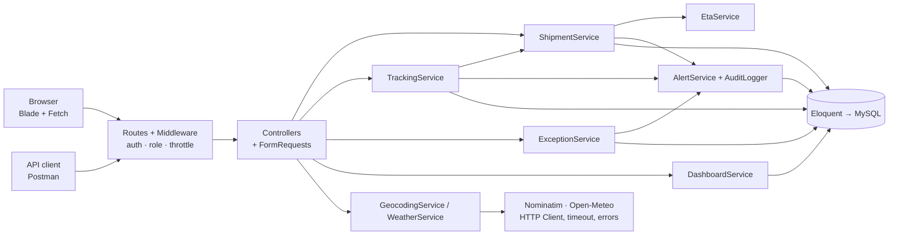
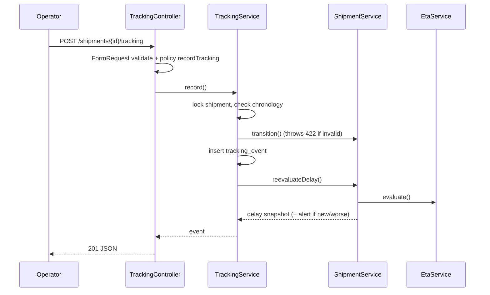

# Architecture

```mermaid
flowchart LR
  B[Browser<br/>Blade + Fetch] --> R[Routes + Middleware<br/>auth · role · throttle]
  X[API client<br/>Postman] --> R
  R --> C[Controllers<br/>+ FormRequests]
  C --> S1[ShipmentService]
  C --> S2[TrackingService]
  C --> S3[ExceptionService]
  C --> S4[DashboardService]
  S2 --> S1
  S1 --> E[EtaService]
  S1 & S2 & S3 --> A[AlertService + AuditLogger]
  C --> G[GeocodingService / WeatherService]
  S1 & S2 & S3 & S4 & A --> M[(Eloquent → MySQL)]
  G --> N[Nominatim · Open-Meteo<br/>HTTP Client, timeout, errors]
```

## Sequence — recording a tracking event

```mermaid
sequenceDiagram
  participant O as Operator
  participant API as TrackingController
  participant T as TrackingService
  participant S as ShipmentService
  participant E as EtaService
  O->>API: POST /shipments/{id}/tracking
  API->>API: FormRequest validate + policy recordTracking
  API->>T: record()
  T->>T: lock shipment, check chronology
  T->>S: transition() (throws 422 if invalid)
  T->>T: insert tracking_event
  T->>S: reevaluateDelay()
  S->>E: evaluate()
  S-->>T: delay snapshot (+ alert if new/worse)
  T-->>API: event
  API-->>O: 201 JSON
```
